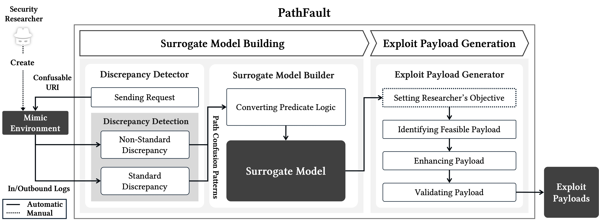

# PathFault: Automated Exploit Generation for Web Applications via HTTP Message Parser Inconsistencies


PathFault is a tool designed to identify and exploit **path confusion vulnerabilities** in modern web applications.  
It leverages HTTP message parser inconsistencies across chained web components to automatically generate and validate effective exploit payloads.

> 📄 If you are looking for how to reproduce the case study in our paper, please refer to the [case study guide](./case_study/README.md).  
> However, we strongly recommend reading this usage guide first to understand how the tool works.

---

## 🔍 About PathFault

**PathFault** implements a two-phase pipeline that automates the entire path confusion exploit generation process.  
The overall architecture is illustrated below:



### Step 1: Building the Surrogate Model

To begin, a penetration tester sets up a **Mimic Environment** that replicates the HTTP processing behavior of the real web application, component by component.  
This environment allows each web component (e.g., Nginx, Apache, Tomcat) to be tested in isolation without actual forwarding, while allowing full observation of request/response behavior.

PathFault assists in constructing this environment and then automatically sends a suite of test requests using the **Inconsistency Detector**, designed to identify deviations from standard URI parsing behavior.  
These inconsistencies—formally called **Path Confusion Patterns (𝒫)**—are extracted by analyzing component-specific logs.

Once detected, these patterns are encoded as predicate logic expressions via the **Surrogate Model Builder**, yielding a formal model that captures each component’s behavior for further analysis.

### Step 2: Exploit Payload Generation and Validation

In the second phase, PathFault utilizes this surrogate model to automatically generate valid exploit payloads.  
Testers can optionally inject **domain-specific knowledge** into the surrogate model—such as internal routing logic or application assumptions—to improve precision and reduce the model gap.

PathFault then:

1. **Generates candidate exploit payloads** using SMT solving based on valid combinations of Path Confusion Patterns.
2. **Expands these payloads** by incorporating normalization behaviors and percent-decoding rules.
3. **Validates each payload** using a re-evaluation stage that disables optimizations to ensure soundness.

The core exploit logic is built based on the [Z3 Theorem Prover](https://github.com/Z3Prover/z3) Python API.

---

## 🧠 Key Benefits

- **Fully automated** exploit generation across multiple web application configurations.
- **Surrogate model-based design**, formalized via predicate logic.
- **Extensible with domain knowledge**, allowing custom condition injection.
- **Component-wise analysis** that isolates inconsistencies in parsing behavior.

---

## Requirements

To ensure a smooth and reproducible experience with PathFault, please review and prepare the following system and software requirements.  
These settings reflect the environment in which all **case studies** were conducted.  
However, the **PathFault tool itself is fully portable** and can be executed on **any environment** where Docker and Python are available.

---

### 🖥️ Hardware & OS (for Reproducing Case Studies)

All case study experiments presented in our paper were conducted on the following setup:

- **CPU**: 11th Gen Intel(R) Core(TM) i5-11600K @ 3.90GHz  
- **Memory**: 16GB RAM  
- **Operating System**: Ubuntu 20.04.6 LTS

PathFault internally performs SMT solving with a fixed random seed.  
Each solving instance is given a **10-second timeout** to ensure fair benchmarking.  
These specs are **not strict requirements** for running PathFault, but are provided for consistency when reproducing results from the paper.

---

### 🐳 Docker & Docker Compose

PathFault uses containerized environments (mimic environments) for testing real-world web application behavior.  
Please install the following packages:

```bash
# Install Docker
sudo apt update
sudo apt install -y docker.io

# Install Docker Compose (v2)
sudo apt install -y docker-compose-plugin

# Enable and start Docker
sudo systemctl enable --now docker
```

Ensure your user has Docker privileges:

```bash
sudo usermod -aG docker $USER
newgrp docker
```

---

### 📦 Install mergecap

PathFault requires `mergecap` to process pcap files when analyzing network traces.  
Please install the following package:

```bash
# Install mergecap (part of the Wireshark suite)
sudo apt update
sudo apt install -y wireshark-common tshark
```

You can verify the installation:

```bash
mergecap -v
```

---


### 🐍 Python Environment

PathFault is implemented in Python 3.12.3.  
We recommend using a virtual environment to isolate dependencies:

```bash
# Create and activate virtual environment
python3 -m venv .venv
source .venv/bin/activate

# Install required dependencies
pip install -r requirements.txt
```

All required Python packages are listed in `requirements.txt`.

---

✅ **Portability Note**  
While our case study evaluations were performed on Ubuntu, **PathFault can be used on any Linux or macOS system** that supports Docker and Python 3.12.  
The tool's modular design and script-based workflows ensure full portability for future extensions or additional testing.


## 🧩 Tool Structure

To support extensibility and clear separation of concerns, **PathFault** is designed as a modular tool.  
The codebase is primarily organized into two top-level module categories:

- **`core/`** – Implements the fundamental logic of PathFault, including inconsistency detection, surrogate modeling, and exploit payload generation.
- **`utilities/`** – Provides supportive functionality to assist the core modules, such as building mimic environments for testing.

Each module internally follows a two-layered architecture:

- **`services/`**: Implements low-level atomic tasks (e.g., sending requests, parsing logs, building constraints).
- **`workflows/`**: Composes services into higher-level, end-to-end processes that automate complete stages of the analysis pipeline.

You can refer to each submodule's `README.md` for usage instructions.

### Core Modules

- [`inconsistency_detector`](./pathfault/modules/core/inconsistency_detector/README.md)  
  Detects HTTP parser inconsistencies and extracts raw logs for analysis.

- [`surrogate_model_builder`](./pathfault/modules/core/surrogate_model_builder/README.md)  
  Translates detected parsing inconsistencies into predicate logic rules to build a surrogate model.

- [`exploit_payload_generator`](./pathfault/modules/core/exploit_payload_generator/README.md)  
  Generates exploit payloads through SMT solving and validates them against the surrogate model.

### Utility Modules

- [`mimic_environment_creator`](./pathfault/modules/utilities/mimic_environment_creator/README.md)  
  Automates the setup of mimic environments using lightweight Docker containers per component.

I guess that this modular architecture enhances the clarity, reusability, and maintainability of PathFault, making it easier to extend or integrate with additional web components or analysis techniques in future research.
